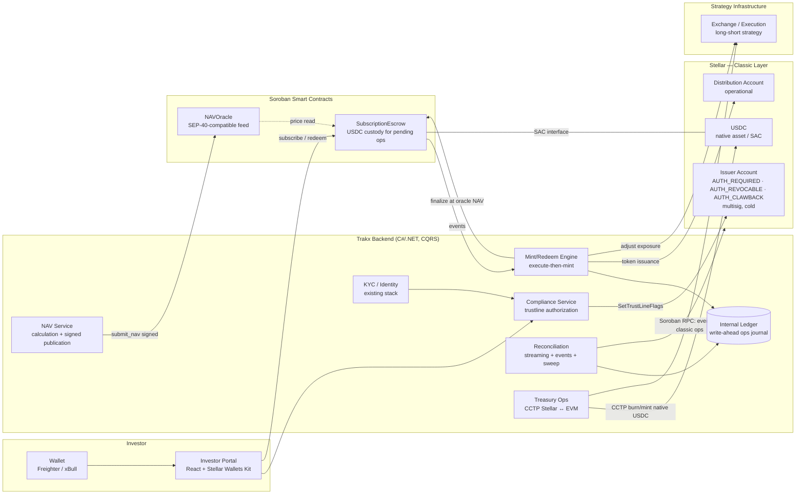
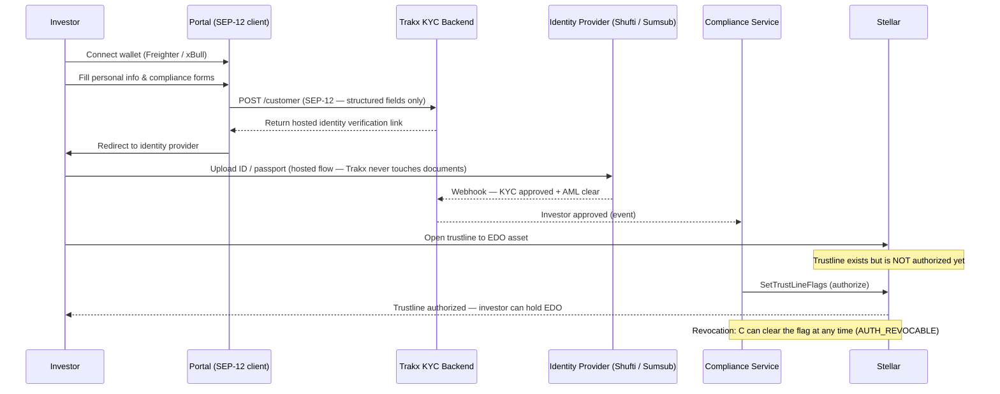
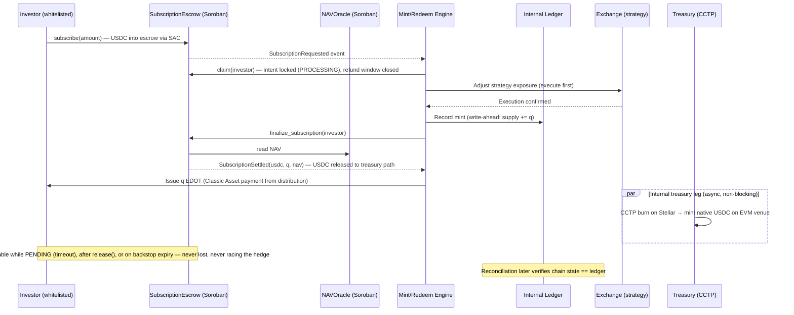
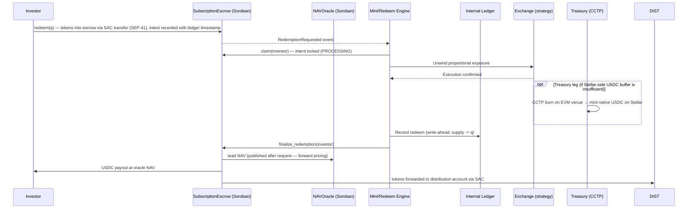

# Technical Architecture — Stellar Strategy Rails

**Product:** Tokenized wrapper for the EDO Theory automated long/short strategy
**Chain:** Stellar — hybrid architecture: Classic Asset for the token, Soroban smart contracts for on-chain logic
**Settlement asset:** native USDC on Stellar
**Issuer:** Trakx (AMF-registered, France)

---

## 1. Design principles

1. **Hybrid architecture: Classic for value, Soroban for logic.** The strategy token is a Stellar Classic Asset with `AUTH_REQUIRED`, `AUTH_REVOCABLE` and `AUTH_CLAWBACK_ENABLED` flags — investor access control enforced at protocol level, with battle-tested security and minimal fees for transfers. All programmable logic that belongs on-chain lives in Soroban smart contracts: the **NAV Oracle** and the **Subscription Escrow**. Contracts interact with the Classic Asset through its built-in Stellar Asset Contract (SAC) interface.
2. **Execute-then-mint.** Tokens are only issued after the corresponding strategy exposure has been adjusted. Every token in circulation is therefore fully backed by the underlying position at all times. There are no liquidity pools and no on-chain market making: the chain is a distribution and ownership registry, not a liquidity venue.
3. **NAV computed off-chain, verifiable on-chain.** NAV is calculated off-chain by the same engine pricing Trakx's indices today (constituent prices, accrued fees, management fees), then published to the Soroban NAV Oracle as a signed submission. The oracle is the single on-chain pricing reference for all mint/redeem operations — and a composable price feed any other Soroban protocol can read.
4. **Write-ahead operational ledger, verified on-chain.** The on-chain state is the authoritative record of ownership and supply. Operationally, because issuance is primary (Trakx initiates every mint and redeem), the platform keeps a write-ahead operational ledger that records supply changes at execution time — before chain confirmation — so hedging never waits on network latency. Chain observation (Soroban RPC event streams, cursor sweep) continuously reconciles the two; a delayed stream can therefore never produce an incorrect hedge — only a reconciliation alert.
5. **Investor settlement on Stellar; treasury mobility via CCTP.** Investors always pay and receive native USDC **on Stellar**. Moving funds between Stellar and the venues where the strategy executes (EVM-based exchange infrastructure) is an internal Trakx treasury operation using Circle's CCTP (native burn-and-mint USDC transfers between Stellar and CCTP-enabled chains). The investor-facing product surface never depends on, or is exposed to, the treasury leg.

## 2. Component overview

## 3. Account & contract model

| Component | Role | Controls |
|---|---|---|
| **Issuer account** | Defines the Classic Asset; sets `AUTH_REQUIRED`, `AUTH_REVOCABLE`, `AUTH_CLAWBACK_ENABLED`; authorizes/revokes trustlines | Cold; multisig (medium/high thresholds); keys under Trakx custody policy. `AUTH_CLAWBACK_ENABLED` is part of day-0 configuration: it must be set **before the first trustline is opened**, since clawback applies only to trustlines created after the flag is enabled and cannot be added retroactively |
| **Distribution account** | Operational account for issuing tokens to investors and receiving them on redemption | Warm; limited balance; multisig on high-value ops |
| **NAVOracle (Soroban)** | On-chain NAV reference: stores latest NAV + history, validates publisher, exposes read functions | `require_auth()` on the authorized publisher address; upgrade/admin gated by issuer multisig |
| **SubscriptionEscrow (Soroban)** | Holds investor USDC for pending subscriptions/redemptions; settles at oracle NAV; refund path | `require_auth()` on operator functions; refunds callable by depositor after timeout |
| **Subscription flows (USDC)** | Monitored via Soroban RPC (contract events + Classic operations) | |

**Stellar Asset Contract deployment.** The EDO asset's **SAC instance is deployed at issuance** (`deploySACWithAsset`), so Soroban contracts — the SubscriptionEscrow in particular — interact with the token through the standard **SEP-41 token interface** (`transfer`, `burn`, and the admin functions `mint` / `set_authorized`). This is what lets the escrow hold and move the Classic Asset natively from contract code. Because the escrow lives at a **contract address (`C…`)**, its authorization to hold the `AUTH_REQUIRED` asset is granted through **`set_authorized` on the SAC** — the contract-address counterpart of `SetTrustLineFlags`, which applies only to standard `G…` accounts (the investor whitelist flow of §5). This authorization is executed once by the issuer at deployment.

**Decimal precision.** The EDO token uses **7 decimal places** — the Classic Asset on-ledger representation — declared in `stellar.toml` and reported by the SAC's `decimals()`; consumers must always read it rather than assume it. The NAV Oracle stores NAV as a **scaled integer (`i128`) with an explicit scale factor** carried in the contract, never as an implicit convention. The escrow performs settlement arithmetic in integer math at full precision and **rounds token quantities down** at mint (and USDC payouts down at redemption), so rounding dust always favors the fund and existing holders — the standard fund-administration convention — while the off-chain NAV engine computes at higher internal precision before quantizing to the published scale.

**Standards note (SEP-57).** We track **SEP-57 — T-REX (Token for Regulated EXchanges)**, the OpenZeppelin-led draft that ports the ERC-3643 permissioned-token framework to Soroban. Phase 1 deliberately uses protocol-native Classic controls (`AUTH_REQUIRED` / `AUTH_REVOCABLE` / `AUTH_CLAWBACK_ENABLED`): they are battle-tested, require no bespoke compliance contracts, and keep the security surface minimal. As SEP-57 matures, the rails can adopt its richer on-chain identity and compliance-module model for products that need it, without changing the issuance architecture.

## 4. Soroban contracts

### 4.1 NAVOracle

A single, deliberately small Rust contract acting as the authoritative on-chain NAV feed for each strategy token.

- **Interface:** SEP-40-compatible price feed functions (`lastprice`, `price(timestamp)`), plus `submit_nav(payload, signature)` for publication and `nav_age()` for staleness checks. SEP-40 compatibility makes the feed **composable**: any other Soroban protocol can consume Trakx product NAVs without custom integration.
- **State (persistent storage):** `LATEST_NAV { value, timestamp }`, a bounded ring buffer of historical entries, `AUTHORIZED_PUBLISHER: Address`, `STALENESS_THRESHOLD: u64`. TTL on persistent entries is extended programmatically by the backend (state-rent maintenance).
- **Publication flow:** the off-chain NAV service signs the payload; `submit_nav` enforces `require_auth()` on the publisher address and validates monotonic timestamps. On success the contract emits a `NAVUpdated(asset, value, timestamp)` event consumed by the backend, the reconciliation service and any third-party subscriber. Publication cadence is configurable: a daily official NAV at minimum, with intraday settlement publications supported (Stellar's sub-cent fees make frequent publication economically negligible). A minimum-interval guard rate-limits submissions on-chain.
- **Circuit breaker (on-chain deviation bound):** `submit_nav` rejects any value deviating from the last accepted NAV beyond a configurable per-product bound (`MAX_DEVIATION`). A rejected submission leaves state untouched, emits no `NAVUpdated`, and surfaces as a failed transaction that the publisher turns into an operator alert; meanwhile `nav_age()` keeps growing and dependent operations pause automatically once the staleness threshold is crossed — the system fails safe (paused, at the last valid price) rather than settling at a wrong one. Genuine extreme market moves are recorded through an override path (`submit_nav_override`) gated on a second, independent admin signature. The bound is a configuration parameter per deployed product, calibrated from each strategy's historical NAV series, complementing the off-chain sanity checks performed before signing (constituent-level outlier detection against stored price history, tolerance scaled by each constituent's volatility).
- **Consumers:** the SubscriptionEscrow reads the oracle for settlement pricing; automated operations pause if `nav_age()` exceeds the staleness threshold.

### 4.2 SubscriptionEscrow

The contract that moves the money path of primary issuance on-chain while preserving execute-then-mint.

- **Intent lifecycle (two-phase settlement):** every operation walks an explicit on-chain state machine — `PENDING → PROCESSING → SETTLED` — so that hedge execution and investor protection can never race each other.
  - **Subscribe (→ PENDING):** the investor calls `subscribe(amount)`; USDC moves from their wallet into the contract in a **single SAC transfer under one signature**. Two per-product parameters govern entry: **`max_subscription`** (the business/compliance ceiling for a single call) and **`slice_size`** (the execution quantum). Amounts above `slice_size` are automatically sliced — the contract assigns a sequential **`request_id`**, creates `ceil(amount / slice_size)` independent intents keyed `(request_id, slice_index)` in the same invocation, each with its own ledger timestamp, and emits `SubscriptionRequested(investor, amount, request_id, slice_index)` per slice. Every slice then walks the state machine independently; `max_subscription / slice_size` naturally bounds slices per call within Soroban per-transaction resource limits. Capacity protection does **not** depend on rejecting entries — it lives in claim pacing: nothing is hedged, and no Trakx risk exists, until the engine claims a slice, at whatever pace the execution buffer supports. Unclaimed slices age into refundability through the standard timeout.
  - **Claim (→ PROCESSING):** when the engine picks a slice up for execution, it calls `claim(request_id, slice_index)` (operator-gated). This **locks the intent** — the refund window closes — and emits `SubscriptionClaimed`. The USDC does **not** leave the contract at claim: locking is a commitment device, not a withdrawal. From this point the deposit is contractually destined to Trakx at settlement, so the engine can hedge against it as a certain receivable rather than investor money at risk.
  - **Finalize (→ SETTLED):** after the backend confirms strategy exposure adjustment (the execute leg), it calls `finalize_subscription(request_id, slice_index)`. The contract reads the current NAV from NAVOracle, computes the token quantity, releases the USDC to the treasury path, and emits `SubscriptionSettled(investor, usdc, tokens, nav)`. Token issuance itself is a Classic Asset payment from the distribution account, executed by the backend in the same logical operation and reconciled against the event.
  - **Release (PROCESSING → refundable):** if execution must be abandoned (venue outage, rejected order), the operator calls `release(request_id, slice_index)`, emitting `SubscriptionReleased`; the refund becomes available to the depositor **immediately**, without waiting for any timeout. The cost of unwinding any partial hedge sits with Trakx — the correct allocation, since Trakx claimed the order.
  - **Backstop:** an intent left in `PROCESSING` beyond a long safety window (order-of-magnitude above any execution latency, e.g. 72h) automatically becomes refundable again. No plausible execution path takes that long, so the backstop never interferes with operations — it only guarantees the investor can never be stranded by a Trakx-side incident between claim and finalize.
- **Forward pricing (next-NAV settlement):** the contract only finalizes against a NAV whose timestamp is **strictly later** than the request timestamp — the standard cut-off rule of traditional fund administration, enforced on-chain. Any NAV visible at request time is therefore indicative only; settlement always occurs at the next published NAV. This structurally eliminates stale-price arbitrage (subscribing at a morning NAV after the market has moved intraday, at the expense of existing holders), and combined with intraday publication cadence it bounds the investor's market-drift exposure between request and settlement to the publication interval.
- **Redeem:** symmetric — tokens enter the escrow via SAC transfer, `redeem` records the intent, `claim` locks it while exposure is unwound, and `finalize_redemption` pays out USDC from the contract at oracle NAV, forwarding tokens to the distribution account. `release()` and the backstop apply identically (tokens returned to the investor instead of USDC).
- **Refund path:** if an operation is not finalized within the applicable timeout, the depositor can call `refund()` and recover their USDC without any Trakx intervention — investor funds are never stranded on operational failure. `refund()` is a **sweep under one signature**: using a bounded per-investor index (`investor → [intent keys]`), it iterates every refundable slice belonging to the caller and returns them in a single invocation — the only iteration the contract ever performs, short by construction. The refund window applies while a slice is `PENDING` (standard timeout), is suspended while it is `PROCESSING` (claimed for execution), and reopens on `release()` or on the backstop expiry. Refunds are always integral per slice: settled slices are final (the exit for those is redemption), unsettled slices refund in full.
- **Configuration:** risk parameters (`max_subscription`, `slice_size`, `refund_timeout`, backstop window) live in contract storage — not in code — and are updated through `set_config(...)`, gated on the admin (issuer multisig), following the same pattern as the oracle's deviation bound. No redeploy needed. Configuration changes apply to **new intents only**: existing intents keep the parameters they were created under, so terms never change beneath a live deposit.
- **Read interface:** lightweight getters serve the portal and reconciliation — `get_request(request_id)` (aggregate progress, e.g. 5/10 slices settled at a running average NAV), `get_intent(request_id, slice_index)` (state verification), `get_requests(investor)` (positions view). Reads are free of transactions; they are for **point lookups, not work discovery** — the execution pipeline is event-driven (see §10).
- **Single contract:** all of the above are functions of one SubscriptionEscrow contract sharing one storage — caller separation comes from `require_auth` per function, not from contract separation. The system's full on-chain surface remains two contracts: NAVOracle (pricing) and SubscriptionEscrow (money and intents), linked only by the cross-contract NAV read at settlement.
- **Authorization:** operator functions gated with `require_auth()` on the operator address (no custom auth logic); depositor functions gated on the depositor's own address.

### 4.3 Implementation practices

Both contracts initialize via **`__constructor`**, which runs once and atomically at deployment — admin, publisher, token references and initial configuration are set in the deploy transaction itself, leaving no separate `initialize` call and therefore **no front-running window** between deployment and initialization. Both contracts are **upgradeable under governance**: `upgrade(new_wasm_hash)` is callable only by the admin (the issuer account's multisig) and takes effect after a **timelock**, announced through an on-chain event, so token holders always have time to observe — and if desired, exit via redemption — before a change activates.

Unit tests in Rust for every contract function; integration tests against Stellar testnet; persistent vs. temporary storage split to manage state rent; events for every state transition so off-chain services subscribe rather than poll. Before mainnet, both contracts go through a structured internal security review — threat modeling, invariant checks and property-based testing of state transitions, with authorization paths and TTL/state-rent handling reviewed explicitly; no contract reaches mainnet before critical and high findings are remediated.

## 5. Investor onboarding & whitelist flow

KYC data collection follows **SEP-12**: the investor portal (or any SEP-12-compliant Stellar wallet) POSTs structured fields — name, address, country, income bracket, professional area — to a `/customer` endpoint on the Trakx backend. The identity verification step (document upload, photo, AML check) remains a hosted redirect to the existing provider (Shufti Pro / Sumsub): the backend generates the verification link, the user completes it on the provider's interface, and the backend receives the result via webhook. **No KYC data is written on-chain.** The only on-chain outcome is a `SetTrustLineFlags` operation authorizing the trustline once the investor passes all checks.

## 6. Mint flow (subscription, execute-then-mint)

## 7. Redeem flow

**Redemption token path (explicit).** Tokens move **investor → escrow contract** via a SAC transfer under the SEP-41 interface, authorized by the investor in the same invocation that records the redemption intent. The escrow's contract address (`C…`) holds EDO tokens transiently between request and settlement; for that, it is authorized by the SAC admin (the issuer) through **`set_authorized`** on the Stellar Asset Contract — the contract-address counterpart of `SetTrustLineFlags`, which applies only to `G…` accounts. On finalize, the escrow pays USDC to the investor at the oracle NAV (forward-priced, symmetric with subscriptions) and forwards the tokens to the distribution account, where they return to inventory; supply reduction, when required, is a subsequent `burn` executed from distribution. This path keeps redemption trustless for the investor — tokens and USDC change hands atomically inside the settlement — at the cost of one explicit issuer authorization for the escrow contract, executed once at deployment.

## 8. Treasury operations (Stellar ↔ EVM via CCTP)

The strategy executes on EVM-based exchange infrastructure, while investors settle exclusively in native USDC on Stellar. Trakx bridges the two internally using Circle's Cross-Chain Transfer Protocol (CCTP), which burns native USDC on the source chain and mints native USDC on the destination chain — no wrapped assets, no third-party bridges.

- **Subscription direction:** USDC released by the escrow is moved to the execution venue as needed to fund exposure. This runs asynchronously; the execute-then-mint ordering is preserved because exposure adjustment (the risk-bearing step) always precedes token issuance.
- **Redemption direction:** USDC is moved back to Stellar to fund payouts. A working USDC buffer is maintained on the Stellar side so that routine redemptions pay out immediately without waiting for a CCTP transfer.
- **Isolation:** the treasury leg is invisible to investors and never a dependency of the investor-facing flow. A delayed CCTP transfer affects internal buffer levels, not investor settlement.
- **Reconciliation:** treasury movements are recorded in the internal ledger and reconciled against both chains, alongside the supply × NAV ≤ collateral invariant.

**Capital flow around settlement (margin, not notional).** Hedge execution never waits for the physical repatriation of escrow USDC. On `claim`, the engine hedges against the locked deposit using balances already on the execution venue — and because initial hedging can run on derivatives, the capital consumed is **margin (a fraction of notional), not the full ticket**. `finalize` then releases the escrow USDC to the treasury path on-chain in the same operation, so Trakx's own-capital exposure lasts minutes (claim → finalize), while the physical Stellar → EVM repatriation runs as a **separate, batched treasury operation** that merely rebalances Trakx-side buffers. The venue-side buffer is therefore sized for margin on peak inflows plus routine flow between treasury cycles — ordinary issuer working capital — never for the largest conceivable subscription.

**Large tickets (institutional practice, not a separate protocol path).** Any ticket enters through the same `subscribe`: the contract auto-slices above the execution quantum, and each slice settles forward-priced at its own next published NAV — the on-chain equivalent of multi-day dealing in traditional funds, visible to the investor as progressive settlement (e.g. 5/10 slices settled at a running average NAV). Advance notice is a **service-level practice, not a protocol requirement**: an announced ticket lets Trakx pre-position treasury and margin and claim slices in quick succession (typically same-day settlement); an unannounced one settles at the pace the execution buffer supports. Reinforced compliance on large tickets (e.g. source-of-funds) also composes naturally with the state machine: the deposit sits in escrow — refundable — while due diligence runs, and the engine only claims after approval, or releases if it fails. Forward pricing applies regardless, so the NAV risk allocation never changes.

## 9. Fee model

Fees are computed off-chain by the NAV engine and reflected in the published NAV; collection happens on-chain through token issuance. Rates and splits are per-product configuration parameters — the rails stay strategy-agnostic.

- **Management fee:** accrued daily in the NAV engine. The NAV published to the oracle is always **net of accrued fees**.
- **Performance fee:** accrued continuously on profits above a **fund-level high-water mark (HWM)**: whenever gross NAV exceeds the HWM, the accrual grows and the published net NAV reflects it. Below the HWM, no performance fee accrues and the HWM does not decrease.
- **Monthly crystallization:** at month-end, the accrued performance fee is collected by **minting new strategy tokens to dedicated fee recipient wallets** (share dilution — no assets leave the strategy). The HWM resets to the crystallization NAV and the accrual resets to zero. The fee mint is a Classic Asset payment from the distribution account, recorded in the internal ledger before issuance like any other supply event.
- **Recipients:** fee tokens are split between Trakx and the strategy manager at contractually configured percentages, paid to dedicated recipient wallets. Recipient wallets hold authorized trustlines under the same protocol-level whitelist as any other holder (`AUTH_REQUIRED` applies universally).
- **Reconciliation:** fee mints are first-class supply events covered by the invariants in the reconciliation section. Dilution changes token count, not collateral, so `supply × NAV ≤ collateral` is preserved by construction — NAV per token adjusts.
- **Roadmap note:** the fund-level HWM is the phase-1 model (simple, battle-tested). A per-token HWM variant (HWM travels with each token, dual sale/month-end triggers, Gross-vs-Net NAV entry) is specified internally and may be evaluated for a later phase if greater precision is required.

## 10. Reconciliation

- **Real-time:** Soroban RPC event streams for both **Soroban contract events** (`NAVUpdated`, `SubscriptionRequested/Settled`, `RedemptionRequested`) and **Classic operations** (payments and trustline changes on the issuer, distribution and escrow-related accounts). The team is aware that the Horizon API is being phased out; the stack standardizes on Soroban RPC, which now serves both Soroban events and Classic operations through a single interface.
- **Sweep:** cursor-based periodic sweep over Soroban RPC as a safety net for anything the streams miss (collector + reconciler pattern), with **Hubble** — Stellar's public analytics dataset — as the backfill source for history beyond the RPC retention window.

**Event pipeline (chain as the durable log).** Contract events are not ephemeral messages: they are written to the ledger and served by Soroban RPC in ledger ranges behind a cursor. The pipeline runs collector-first: the **collector** reads events in ledger order, persists its cursor, projects each intent into the operational database (the live work queue and operations record), and only then publishes per-intent messages to the internal message broker for the execution workers. Projections are therefore rebuildable end to end — a crashed consumer resumes from its cursor; a lost queue or database is reconstructed by replaying events from the chain (RPC within its retention window, Hubble beyond it). The chain is the event store; everything off-chain is a disposable, rebuildable view.

**Ordering and idempotency.** The broker provides at-least-once, unordered delivery — and the design requires nothing more. Slices are independent, so cross-slice ordering is irrelevant (each settles at its own forward-priced NAV regardless of processing order), and intra-slice ordering is enforced by the contract's own state machine: a `claim` on a non-PENDING slice or a `finalize` without claim simply fails with a clean error, so out-of-order processing can produce a rejected transaction but never a corrupted state — the contract is the sequencer, the broker is only transport. Workers upsert by the natural key `(request_id, slice_index)` with state-guarded transitions, making duplicates and stragglers no-ops.

**Retention.** Queue messages die on acknowledgment; the operations record does not. Settled intents are never deleted — they feed the state-level reconciliation (a settled slice on-chain must have its internal counterpart), constitute the write-ahead supply history, and form the regulated issuer's operations register under applicable retention obligations. Rows move from live states to an append-only settled record, archived to cold storage per retention policy rather than removed.
- **Invariants checked:** circulating supply (chain) == internal ledger supply; supply × NAV ≤ collateral held in the strategy infrastructure; escrow USDC balance == sum of pending intents.
- Discrepancies never auto-correct money paths; they raise alerts for operator review.

## 11. Trust boundaries & failure modes

| Boundary | Risk | Mitigation |
|---|---|---|
| Issuer keys | Compromise = unauthorized issuance | Cold storage, multisig, minimal signing surface |
| NAVOracle publication | Wrong/stale NAV misprices settlement | `require_auth()` on publisher, monotonic timestamps, on-chain deviation bound (circuit breaker) with admin override, `nav_age()` staleness pause, constituent-level sanity checks off-chain before signing |
| Stale-price arbitrage | Subscribing at an outdated NAV after intraday market moves, at existing holders' expense | Forward pricing enforced on-chain: settlement only at a NAV published after the request timestamp; intraday publication cadence bounds the drift window |
| SubscriptionEscrow | Contract bug affecting custodied USDC | Small bounded surface, Rust unit + testnet integration tests, structured security review (invariant + property-based testing) before mainnet, refund path guarantees depositor recovery |
| Claimed intent stranded (Trakx-side incident between claim and finalize) | Investor locked without USDC or tokens | Funds never leave escrow at claim; `release()` reopens refund immediately; automatic backstop reopens it after a long safety window regardless of operator action |
| Oversized subscription vs. execution capacity | Hedge cannot be funded at required speed | Auto-slicing to the execution quantum; claim pacing as the capacity throttle (no risk exists before claim); per-invocation slice ceiling bounded by protocol resource limits |
| RPC event streams | Missed events | Write-ahead ledger (streams only verify), cursor sweep + Hubble backfill |
| Exchange execution | Slippage between quote and fill | Execute-then-mint ordering; Phase 3 slippage buffer on sizing |
| CCTP treasury leg | Delayed/failed cross-chain transfer | Internal-only operation (never blocks investor settlement); Stellar-side USDC buffer for routine redemptions; transfers reconciled in the internal ledger |
| Investor wallet | Lost keys | `AUTH_CLAWBACK_ENABLED` (set at issuance, before any trustline) lets the issuer claw back and reissue tokens under a documented recovery procedure |

### STRIDE threat model

| Category | Threats in this system | Mitigations |
|---|---|---|
| **S**poofing | Unauthorized NAV publisher; forged operator/admin calls; impersonated investor | `require_auth()` (ed25519) on every privileged function — publisher on `submit_nav`, operator on `claim`/`finalize`/`release`, admin (issuer multisig) on `set_config`/`upgrade`; depositor functions bound to the depositor's own address |
| **T**ampering | Manipulated NAV values; corrupted upstream price data; unauthorized state mutation | On-chain deviation bound (circuit breaker) with dual-signature override; monotonic timestamp validation; constituent-level outlier checks off-chain before signing; contract state mutable only through the authorized state machine |
| **R**epudiation | Disputed subscriptions, settlements or fee mints | Every state transition emits an event on an immutable public ledger; transaction hashes as evidence; append-only operations record retained under regulated-issuer obligations |
| **I**nformation disclosure | KYC/PII exposure; investor privacy | No KYC data on-chain — only the authorization outcome (trustline flag); identity verification on the provider's hosted flow, documents never touching Trakx or the chain; minimal on-chain footprint (amounts and addresses only) |
| **D**enial of service | Publisher outage; RPC/stream outage; stale NAV; spam submissions | Fail-safe staleness pause (operations halt at the last valid price, never a wrong one); refund path + automatic backstop guarantee investor exit regardless of Trakx availability; on-chain minimum publication interval as rate-limit; Stellar-side USDC buffer for routine redemptions; cursor replay + Hubble backfill for observation recovery |
| **E**levation of privilege | Compromised operator key; abuse of admin power | Operator authority is bounded by the state machine — it can only advance intents along predefined paths, with funds moving exclusively to the treasury path or back to depositors, never to arbitrary destinations; admin actions require the issuer multisig; upgrades additionally sit behind a timelock with on-chain announcement |

## 12. Delivery phases (mapped to SCF tranches)

| Phase | Deliverables | Stellar surface |
|---|---|---|
| **1 — MVP** | Token issuance on testnet (flags, multisig); compliance & whitelist service; **NAVOracle contract live on testnet** (SEP-40-compatible, signed publication, on-chain deviation bound, events) | `SetOptions`, `ChangeTrust`, `SetTrustLineFlags`, `Payment`; Soroban: contract deploy, `require_auth`, events, state rent |
| **2 — Testnet** | **SubscriptionEscrow contract** + automated mint/redeem with next-NAV (forward-priced) settlement; investor portal (Stellar Wallets Kit: Freighter, xBull); reconciliation & reporting incl. contract events | SAC token transfers, cross-contract reads, Soroban RPC event streams (Soroban + Classic) |
| **3 — Mainnet** | Fee engine (management fee + performance fee with fund-level HWM, monthly crystallization via share dilution) & execution-risk framework; security review & remediation; mainnet launch with escrow-based mint/redeem; production hardening & monitoring | Mainnet ops, contract deploys, runbooks |

## 13. Stack

- **Contracts:** Rust / Soroban SDK; soroban-rpc for simulation and submission
- **Backend:** C#/.NET microservices (CQRS), .NET Stellar SDK, Soroban RPC (Hubble for historical backfill)
- **Frontend:** React/TypeScript, [Stellar Wallets Kit](https://stellarwalletskit.dev/)
- **Infra:** AWS EKS, PostgreSQL (internal ledger + reconciliation snapshots), existing Trakx observability stack (alerts on mint/redeem failures, NAV freshness, escrow balance, reconciliation breaks)
