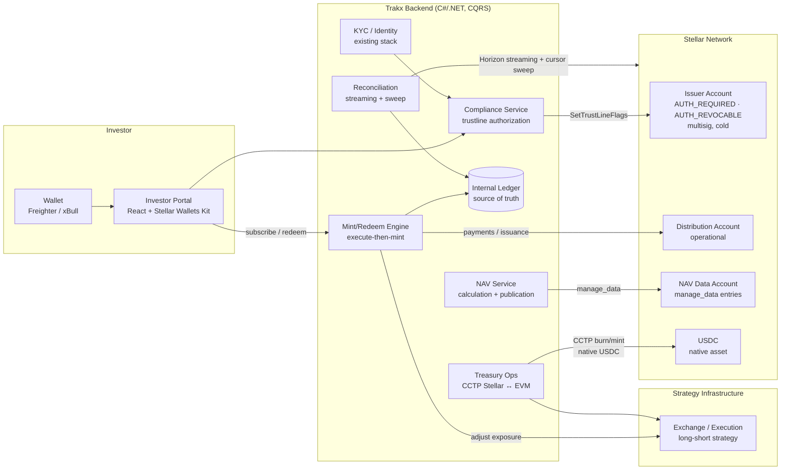
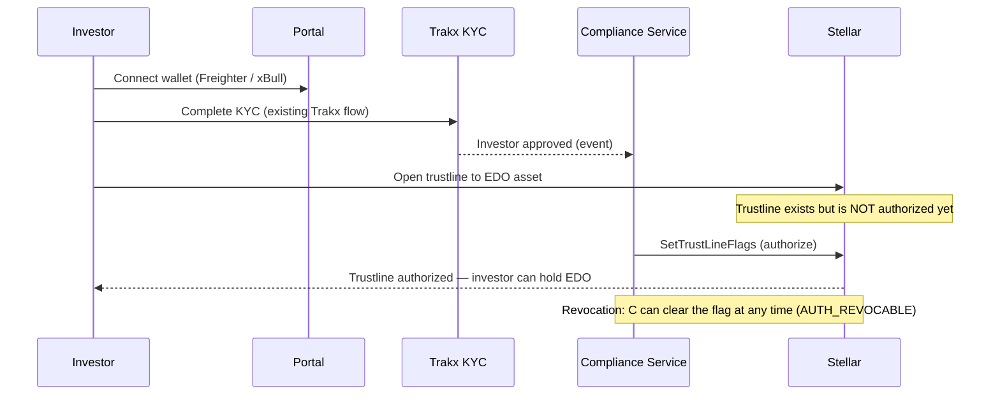
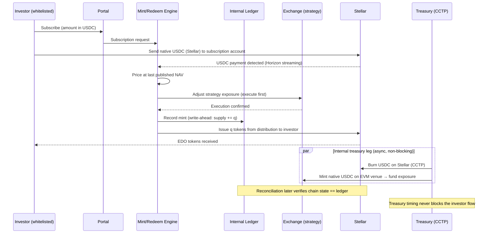
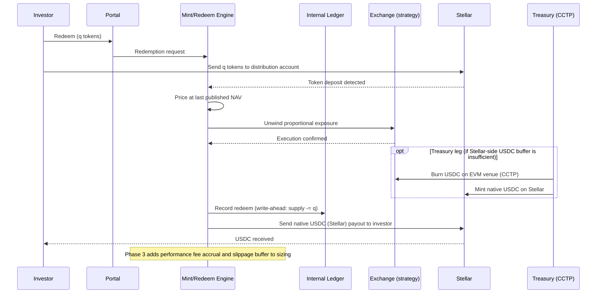
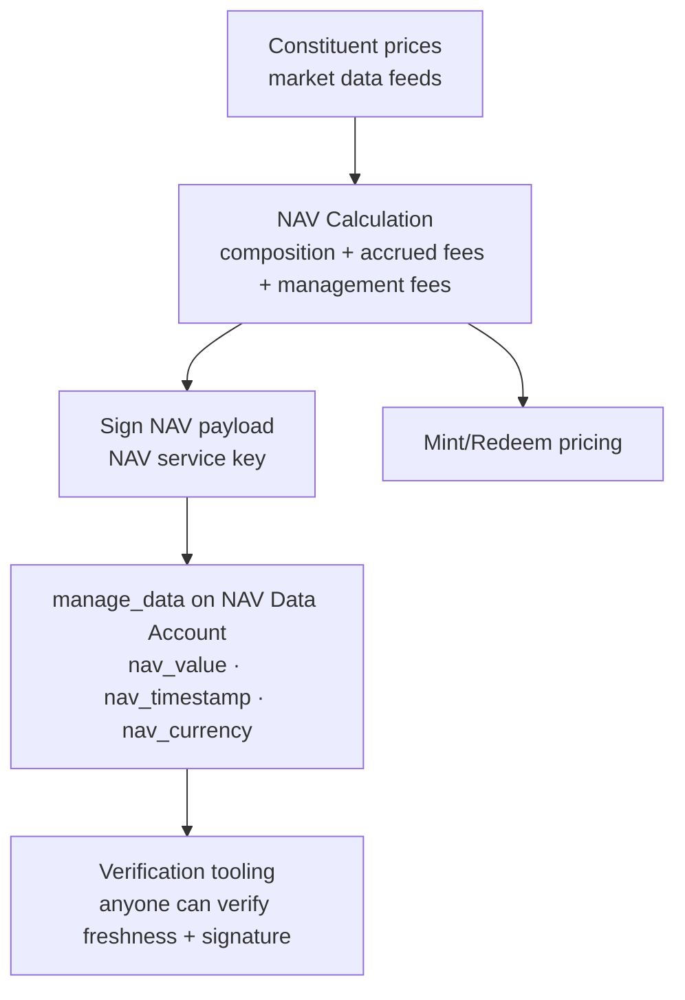

# Technical Architecture — Stellar Strategy Rails

**Product:** Tokenized wrapper for the EDO Theory automated long/short strategy
**Chain:** Stellar (Classic Assets + Horizon; no custom smart contracts in scope)
**Settlement asset:** native USDC on Stellar
**Issuer:** Trakx (AMF-registered, France)

---

## 1. Design principles

1. **Compliance as a protocol primitive.** The strategy token is a Stellar Classic Asset with `AUTH_REQUIRED` and `AUTH_REVOCABLE` flags. Only accounts whose trustlines Trakx has explicitly authorized can hold the token. No custom contract code means no bespoke audit surface and a compliance model that regulators can verify directly against Stellar's documented semantics. (A Stellar Asset Contract is created automatically for the asset, keeping future Soroban interoperability open without migration.)
2. **Execute-then-mint.** Tokens are only issued after the corresponding strategy exposure has been adjusted. Every token in circulation is therefore fully backed by the underlying position at all times. There are no liquidity pools and no on-chain market making: the chain is a distribution and ownership registry, not a liquidity venue.
3. **Off-chain NAV, on-chain publication.** NAV is computed off-chain from constituent prices, accrued fees and management fees, then published on-chain as signed data. All mint/redeem operations price against the last published NAV. Mint/redeem at NAV acts as a natural arbitrage anchor for any secondary market that may emerge.
4. **Internal ledger as source of truth.** Because issuance is primary (Trakx initiates every mint and redeem), the internal ledger records supply changes at execution time — before chain confirmation. Chain observation (streaming + sweep) is used for **reconciliation and verification**, never as the primary input to hedging decisions. A delayed stream can therefore never produce an incorrect hedge — only a reconciliation alert.
5. **Investor settlement on Stellar; treasury mobility via CCTP.** Investors always pay and receive native USDC **on Stellar**. Moving funds between Stellar and the venues where the strategy executes (EVM-based exchange infrastructure) is an internal Trakx treasury operation using Circle's CCTP (native burn-and-mint USDC transfers between Stellar and CCTP-enabled chains). The investor-facing product surface never depends on, or is exposed to, the treasury leg.

## 2. Component overview

## 3. Account model

| Account | Role | Controls |
|---|---|---|
| **Issuer** | Defines the asset; sets `AUTH_REQUIRED`, `AUTH_REVOCABLE`; authorizes/revokes trustlines | Cold; multisig (medium/high thresholds); keys under Trakx custody policy |
| **Distribution** | Operational account for issuing tokens to investors and receiving them on redemption | Warm; limited balance; multisig on high-value ops |
| **NAV data** | Holds `manage_data` entries: `nav_value`, `nav_timestamp`, `nav_currency` | Signed exclusively by the NAV service key |
| **Subscription (USDC)** | Receives investor USDC on subscription; sources USDC payouts on redemption | Monitored via Horizon streaming |

## 4. Investor onboarding & whitelist flow

## 5. Mint flow (subscription, execute-then-mint)

## 6. Redeem flow

## 6a. Treasury operations (Stellar ↔ EVM via CCTP)

The strategy executes on EVM-based exchange infrastructure, while investors settle exclusively in native USDC on Stellar. Trakx bridges the two internally using Circle's Cross-Chain Transfer Protocol (CCTP), which burns native USDC on the source chain and mints native USDC on the destination chain — no wrapped assets, no third-party bridges.

- **Subscription direction:** USDC received on Stellar is moved to the execution venue as needed to fund exposure. This runs asynchronously; the execute-then-mint ordering is preserved because exposure adjustment (the risk-bearing step) always precedes token issuance.
- **Redemption direction:** USDC is moved back to Stellar to fund investor payouts. A working USDC buffer is maintained on the Stellar side so that routine redemptions pay out immediately without waiting for a CCTP transfer.
- **Isolation:** the treasury leg is invisible to investors and never a dependency of the investor-facing flow. A delayed CCTP transfer affects internal buffer levels, not investor settlement.
- **Reconciliation:** treasury movements are recorded in the internal ledger and reconciled against both chains, alongside the supply × NAV ≤ collateral invariant.

## 7. NAV calculation & publication

- NAV is computed once, off-chain, from a single market-data source already operated by Trakx (APIs + websockets).
- Publication cadence: daily (configurable). Mint/redeem operations always reference the last published NAV; staleness beyond a freshness threshold pauses automated operations and raises an alert.

## 8. Reconciliation

- **Real-time:** Horizon streaming on payments/effects for the issuer, distribution, NAV and subscription accounts.
- **Sweep:** cursor-based periodic sweep over Horizon as a safety net for anything the stream misses (collector + reconciler pattern).
- **Invariant checked:** circulating supply (chain) == internal ledger supply, and supply × NAV ≤ collateral held in the strategy infrastructure.
- Discrepancies never auto-correct money paths; they raise alerts for operator review.

## 9. Trust boundaries & failure modes

| Boundary | Risk | Mitigation |
|---|---|---|
| Issuer keys | Compromise = unauthorized issuance | Cold storage, multisig, minimal signing surface |
| NAV publication | Wrong/stale NAV misprices mint/redeem | Signed payloads, freshness threshold pauses automation, dual-source price sanity checks |
| Horizon streaming | Missed events | Write-ahead ledger (streams only verify), cursor sweep backfill |
| Exchange execution | Slippage between quote and fill | Execute-then-mint ordering; Phase 3 slippage buffer on sizing |
| CCTP treasury leg | Delayed/failed cross-chain transfer | Internal-only operation (never blocks investor settlement); Stellar-side USDC buffer for routine redemptions; transfers reconciled in the internal ledger |
| Investor wallet | Lost keys | `AUTH_REVOCABLE` + clawback-capable issuance policy enables regulated-issuer recovery procedures |

## 10. Delivery phases (mapped to SCF tranches)

| Phase | Deliverables | Chain surface |
|---|---|---|
| **1 — MVP** | Token issuance on testnet (flags, multisig), compliance & whitelist service, on-chain NAV publication | `SetOptions`, `ChangeTrust`, `SetTrustLineFlags`, `ManageData`, `Payment` |
| **2 — Testnet** | Automated mint/redeem at NAV (Horizon streaming), investor portal (Stellar Wallets Kit: Freighter, xBull), reconciliation & reporting | Streaming, cursor pagination |
| **3 — Mainnet** | Performance fee (high-water mark) & execution-risk framework, mainnet launch with OTC mint/redeem, production hardening & monitoring | Mainnet ops, runbooks |

## 11. Stack

- **Backend:** C#/.NET microservices (CQRS), .NET Stellar SDK, Horizon API
- **Frontend:** React/TypeScript, [Stellar Wallets Kit](https://stellarwalletskit.dev/)
- **Infra:** AWS EKS, PostgreSQL (internal ledger + reconciliation snapshots), existing Trakx observability stack (alerts on mint/redeem failures, NAV freshness, reconciliation breaks)
