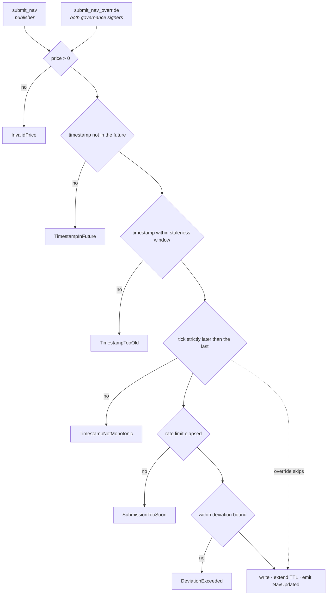

# Reading the NAVOracle

A walkthrough of [`contracts/nav-oracle`](../contracts/nav-oracle) for someone who
writes software but has never touched Rust or Soroban. Every concept is
introduced where the code first needs it.

For the specification this implements, see [`ARCHITECTURE.md`](ARCHITECTURE.md)
§4.1. For the interface and the requirement→test traceability table, see the
[contract README](../contracts/nav-oracle/README.md).

---

## What this thing is

A Soroban contract is a program compiled to WebAssembly and stored on the
Stellar ledger. It has no server, no process, no memory of its own between
calls. It wakes up when a transaction invokes one of its functions, reads and
writes a small key–value store attached to its address, and goes back to sleep.

This one holds a single number — the net asset value of one Trakx strategy
token, in USDC — and the rules about who may change it and by how much.
Everything else in the file exists to protect that number.

Trakx computes the NAV off-chain, in the same engine that prices its indices
today. The contract's job is not to calculate it but to be the one place where
the value is *published*, so that mint and redeem settle against something
public, timestamped, and impossible for one person to move alone.

## Five things Soroban does differently

| | |
|---|---|
| **Storage is rented, not owned** | Every stored entry has a time-to-live measured in ledgers (~5 seconds each). Let it lapse and the entry is archived. Contracts extend their own TTLs. |
| **Three storage tiers** | `instance` travels with the contract, `persistent` is durable independent state, `temporary` expires into nothing. The choice between the last two turns out to be a safety decision here, not just a cost one. |
| **Authorization is declarative** | `address.require_auth()` asserts that this address signed for this exact call with these exact arguments. The host verifies it; the contract never handles a signature. |
| **No floating point** | Money is integers. A NAV of 100.25 USDC is stored as `10_025_000_000_000_000` — the value times 10^14. The scale is declared once and read by consumers. |
| **Failure is total** | A function that returns an error rolls the whole transaction back. There is no partial write. This is what lets the validation code simply `return` and be sure nothing was left behind. |

## The shape of the code

Rust splits a program into modules; `lib.rs` is the entry point that pulls the
others in.

| File | Holds |
|---|---|
| `src/types.rs` | Data structures, the list of possible errors, event definitions. No logic. |
| `src/lib.rs` | The contract: the functions a transaction can call, and the private helpers they share. |
| `src/test.rs` | 31 tests. Longer than the contract, deliberately — most assert that a bad submission is refused. |

The first line of `lib.rs` is `#![no_std]`: build without Rust's standard
library. There is no operating system inside a WebAssembly contract — no files,
no clock, no network. Anything resembling the outside world arrives through a
single handle called `Env`, which every function receives as its first argument.

## Two kinds of settings, and why they are separate

```rust
/// The immutable definition of the feed, fixed at deployment.
pub struct FeedDefinition {
    pub base: Asset,        // what NAV is denominated in — USDC
    pub quote: Asset,       // the strategy token being priced
    pub decimals: u32,      // the scale: 14
    pub resolution: u32,    // tick length in seconds: 3600
}

/// Risk parameters, retuned per product without a redeploy.
pub struct OracleConfig {
    pub staleness_threshold: u64,      // when consumers must pause
    pub max_deviation_bps: u32,        // circuit breaker, in basis points
    pub min_submission_interval: u64,  // on-chain rate limit
    pub history_size: u32,             // ring buffer capacity
    pub upgrade_timelock: u64,         // announcement period
}
```

> **Rust** — `struct` is a record type; `pub` makes a field visible outside its
> module. `u32` and `u64` are unsigned integers of 32 and 64 bits. Rust makes
> you pick the width, and the width is part of the on-chain interface.

SEP-40, the Stellar price-feed standard, requires that `decimals` and
`resolution` never change once other contracts depend on them. Putting them in a
structure with no setter makes that structural rather than a promise in a
comment. `OracleConfig` is the opposite: it exists to be changed. Each product
gets a deviation bound calibrated from that strategy's own historical NAV
series, and changing it is a governance action, not a new deployment.

### On the NAV scale

`decimals` is 14 — the convention among Soroban price feeds. It is worth being
explicit about why it is not 18, because the constituents Trakx hedges on EVM
venues generally are:

| Convention | Scale | What it measures |
|---|---|---|
| ERC-20 tokens | 18 | balances |
| Chainlink feeds | 8 | prices |
| Soroban price feeds | 14 | prices |
| Stellar Classic assets | 7 | balances |

18 decimals is a *balance* convention — `wei`. The NAV is a price, not a
balance, and even on EVM the price convention is 8. The 18-decimal constituent
balances live in the off-chain NAV engine's arithmetic, which computes at higher
internal precision and quantizes once to the published scale (`ARCHITECTURE.md`
§3).

The scale also cancels out of settlement entirely, so it carries no precision
consequence downstream:

```
tokens_out = usdc_raw × 10^D / nav_raw
           = (usdc × 10^7 × 10^D) / (nav × 10^D)
           = usdc × 10^7 / nav
```

Output precision is bounded by the token's 7 decimals, not by the NAV's scale.
The contract accepts any scale from 6 to 18 and rejects the rest at deployment —
outside that range a value is a typo rather than a choice.

### The record that carries two timestamps

```rust
pub struct NavRecord {
    pub price: i128,
    pub timestamp: u64,     // the SEP-40 tick
    pub published_at: u64,  // when the ledger accepted it
}
```

SEP-40 says a price point's timestamp must be rounded down to the feed's
resolution: `floor(t / 3600) * 3600`. Consumers look up history by that rounded
value, so it has to be exact.

But the escrow contract that will settle subscriptions (§4.2) has a different
rule, borrowed from traditional fund administration: **settle only at a NAV
published strictly after the request came in.** That rule stops an investor
subscribing at this morning's price after the market has moved, at the expense
of everyone already in the fund.

Round a NAV published at 17:00 down to a daily tick and it becomes 00:00 — which
appears to precede a request made at 10:00. Forward pricing would silently pass,
and the fund would settle at exactly the stale price the rule exists to prevent.
So the record keeps both: the tick for SEP-40 lookups, and the real acceptance
time for staleness and for settlement.

## The write path

Every accepted NAV — routine or override — goes through one private function,
`record_nav`. Concentrating the rules in one place is what makes them auditable:
there is no second way in.

```rust
fn record_nav(env: &Env, price: i128, timestamp: u64, is_override: bool) -> Result<(), Error> {
    if price <= 0 {
        return Err(Error::InvalidPrice);
    }
    let now = env.ledger().timestamp();
    if timestamp > now {
        return Err(Error::TimestampInFuture);
    }

    let config = config(env);
    // A valuation already older than the staleness window is not publishable:
    // accepting one would stamp `published_at = now` on it, so the feed would
    // report itself fresh while serving an ancient price.
    if now.saturating_sub(timestamp) > config.staleness_threshold {
        return Err(Error::TimestampTooOld);
    }
    let tick = trim(timestamp, resolution(env));

    if let Some(last) = latest(env) {
        if tick <= last.timestamp {
            return Err(Error::TimestampNotMonotonic);
        }
        if !is_override && now.saturating_sub(last.published_at) < config.min_submission_interval {
            return Err(Error::SubmissionTooSoon);
        }
        if !is_override && !within_deviation_bound(last.price, price, config.max_deviation_bps) {
            return Err(Error::DeviationExceeded);
        }
    }

    // ... only now is anything written
}
```

> **Rust** — `Result<(), Error>` means "succeeds with nothing, or fails with an
> `Error`". `()` is the empty type; the function's value is its effect. Rust has
> no exceptions, so every failure path is visible in the signature.
>
> `&Env` is a *borrow*: the function reads the environment without taking
> ownership. Ownership is tracked at compile time, which is how Rust guarantees
> memory safety without a garbage collector.
>
> `if let Some(last) = latest(env)` unwraps an `Option` — a value that is either
> `Some(x)` or `None`. Rust has no null; the absent case is a variant you are
> forced to handle, so "the NAV has not been published yet" cannot be forgotten.
>
> `saturating_sub` subtracts but stops at zero instead of wrapping. The release
> build turns integer overflow into a crash, so arithmetic on untrusted numbers
> is written to be explicitly safe.

Every check returns before any write. Combined with Soroban rolling back a
failed transaction entirely, a rejected submission leaves the stored NAV
untouched and emits no event — the property the tests assert most carefully.

### The gauntlet

Read top to bottom, the checks form a ladder. The override skips exactly two
rungs and no others.



### Why rejection is silent

When the circuit breaker fires, the contract writes nothing and emits nothing.
That looks unhelpful until you follow what happens next: the submission surfaces
as a failed transaction, which the publisher turns into an operator alert.
Meanwhile `nav_age()` keeps growing, and once it crosses the staleness
threshold, everything depending on this feed pauses on its own.

The system stops at the last price it knows to be good, rather than settling at
one it does not. Nobody has to intervene for that to happen — which is the
point.

## Who is allowed to do what

Three roles, held by three addresses the constructor refuses to let overlap.
That refusal matters: `require_auth()` called twice on the same address is
satisfied by a single signature, so one address in two roles would quietly turn
a two-signature rule into a one-signature rule with nothing on the surface to
show it.

| Action | Publisher | Admin alone | Both signers |
|---|---|---|---|
| `submit_nav` | yes | no | — |
| `submit_nav_override` | no | no | yes |
| `set_config` | no | no | yes |
| `set_publisher` | no | no | yes |
| `set_governance` | no | no | yes |
| `schedule` / `apply` / `cancel_upgrade` | no | no | yes |
| `extend_ttl` | anyone | | |

An earlier version required both signatures only for `submit_nav_override`, and
let the admin act alone on `set_config` and `set_publisher`. Code review found
this made the two-signature rule decorative: an admin could install its own
publisher, or widen the deviation bound to its maximum, and then push any value
through the ordinary `submit_nav` — reaching the override's outcome without the
second signature ever being given. Every privileged action now goes through the
same gate.

One consequence for whoever writes the monitoring: the two signers *together*
can still widen the bound and publish normally. That is not a hole — it takes
the same approval the override takes — but the resulting event says
`overridden: false`. Alerting has to correlate a `ConfigUpdated` event with the
publications that follow it, rather than trusting that one flag.

## The storage decision that is really a safety decision

Look again at the write path: monotonicity, the rate limit and the deviation
bound all live inside `if let Some(last)`. They are enforced only *if the
previous record can be read.*

That would be alarming if an expired entry read back as absent. In Soroban it
depends entirely on the tier. A **temporary** entry expires into `None` — so
with temporary storage, a submission after expiry would sail past all three
checks. A **persistent** entry cannot be read at all once archived: the
transaction fails outright until someone restores it.

The NAV and its history are persistent. That is why the checks are safe as
written, and why the code carries the reason next to the decision — a future
change to temporary storage, justified as a rent saving, would silently remove
three invariants.

## Upgrades, on a delay

Contracts can replace their own code. That is a large amount of power to hold
over people whose money settles against this feed, so it is spent in three steps
rather than one.

1. `schedule_upgrade(hash)` — both signatures. Records the new code's hash and
   emits an event announcing when it becomes applicable.
2. The timelock elapses. Clamped by the contract to between 24 hours and 90
   days, so governance cannot set it to zero and upgrade in the same
   transaction.
3. `apply_upgrade()` — both signatures again. Only now does the code change.

The announcement is the substance of it: holders see the change coming on-chain
and have time to redeem before it activates. `cancel_upgrade()` exists for the
case where they should not have to.

## Running it without installing anything

The toolchain is a Docker image, so reviewing the contract needs no Rust on your
machine.

```
make test     # 31 unit tests
make build    # release .wasm for wasm32v1-none
make check    # fmt + clippy (warnings denied) + tests
```

`clippy` is Rust's linter, and the build treats its warnings as errors. It is
what forced the constructor's arguments to be grouped into `FeedDefinition` —
nine parameters tripped a lint, and the fix turned out to be better design than
the code it replaced.
